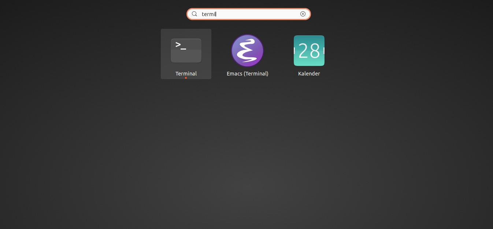

summary: How to navigate in the terminal
id: terminal-navigation
categories: basics
tags: bash
status: Published 
authors: JM
Feedback Link: https://github.com/experimental-software/linux-training/issues

# Terminal Navigation

## Start the terminal

Press the Super Key and then type in "terminal".




## Show current path

Type in "pwd" into the terminal to print the current path.

```bash
$ pwd
/home/jdoe/src/experimental-software/linux-training
```

## Change to another directory

Changing to another directory can be done with the built-in command `cd`.

### Go to home directory

```
cd ~
```

### Go to previous directory

```
cd -
```
